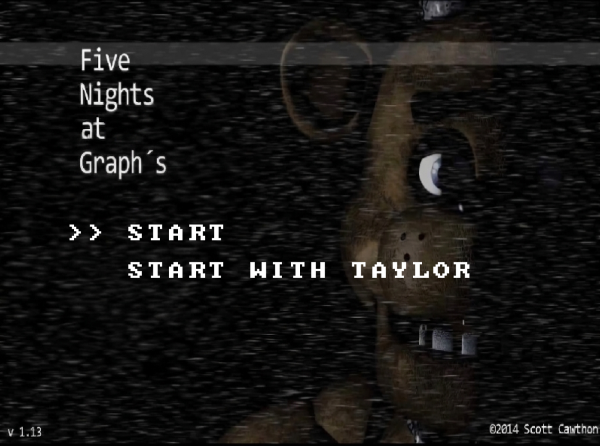
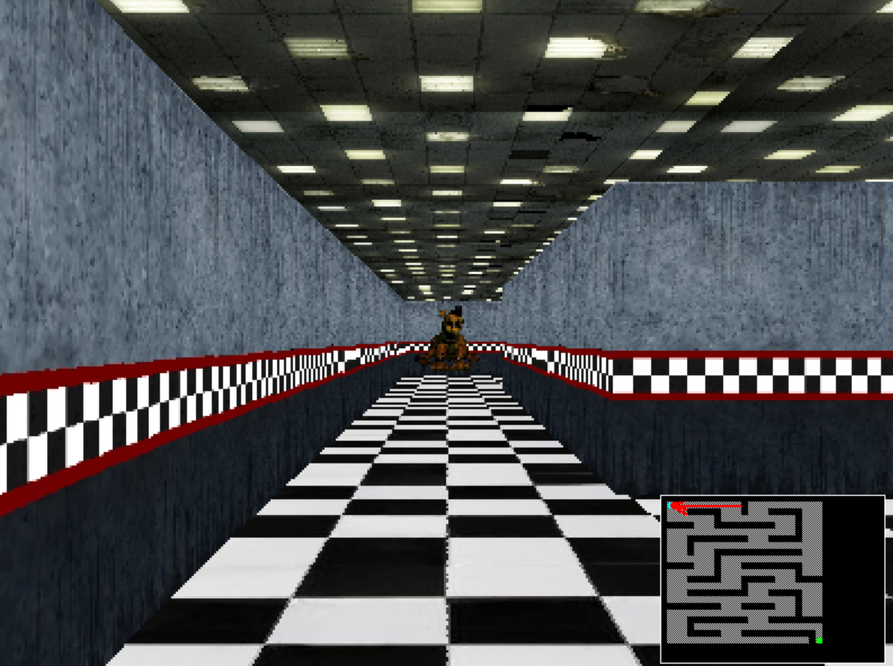
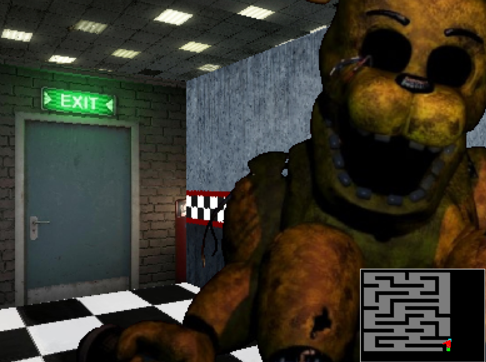

```text
███╗   ███╗ █████╗ ███████╗███████╗ ██████╗ █████╗ ███████╗████████╗███████╗██████╗
████╗ ████║██╔══██╗╚══███╔╝██╔════╝██╔════╝██╔══██╗██╔════╝╚══██╔══╝██╔════╝██╔══██╗
██╔████╔██║███████║  ███╔╝ █████╗  ██║     ███████║███████╗   ██║   █████╗  ██████╔╝
██║╚██╔╝██║██╔══██║ ███╔╝  ██╔══╝  ██║     ██╔══██║╚════██║   ██║   ██╔══╝  ██╔══██╗
██║ ╚═╝ ██║██║  ██║███████╗███████╗╚██████╗██║  ██║███████║   ██║   ███████╗██║  ██║
╚═╝     ╚═╝╚═╝  ╚═╝╚══════╝╚══════╝ ╚═════╝╚═╝  ╚═╝╚══════╝   ╚═╝   ╚══════╝╚═╝  ╚═╝
```

<p align="center">
  
  
  
  
</p>

<p align="center">
  <b>Un motor de raycasting en Rust que te encierra en un laberinto oscuro... y no estás solo.</b><br/>
  Encuentra la salida antes de que Freddy te encuentre a ti.
</p>

---

## ¿Qué es esto?

**MazeCaster** es un pseudo-3D raycaster desarrollado desde cero en Rust e inspirado visualmente en *Five Nights at Freddy's*.

El jugador debe recorrer un laberinto texturizado, orientarse utilizando las vistas 2D y 3D, encontrarse con Golden Freddy y finalmente localizar la puerta de salida para sobrevivir la primera noche.

El nivel se construye a partir de `maze.txt`, por lo que su estructura puede modificarse sin cambiar el código del motor.

---

## Gameplay

<p align="center">
  
</p>

<p align="center">
  <i>Elige cómo quieres comenzar la noche.</i>
</p>

<br>

<p align="center">
  
  
</p>

<p align="center">
  <i>Explora el laberinto, encuentra a Golden Freddy y busca la salida.</i>
</p>

La vista principal utiliza raycasting para representar el laberinto en pseudo-3D. En la esquina inferior derecha permanece visible el mapa 2D.

<br>

### Encuentra la salida

<p align="center">
  
</p>

<p align="center">
  <i>La salida está cerca. Golden Freddy también.</i>
</p>

La puerta de salida utiliza su propia textura dentro del mundo 3D y Golden Freddy aparece como un sprite animado dentro del laberinto.

---

## Features

- Raycasting DDA en tiempo real
- Corrección del efecto fish-eye
- Paredes completamente texturizadas
- Piso texturizado
- Techo texturizado
- Puerta de salida integrada al mundo 3D
- Golden Freddy como sprite animado de dos frames
- Soporte para múltiples Golden Freddy mediante `f`
- Transparencia RGBA para sprites PNG
- Perspectiva de sprites según su distancia
- Oclusión de sprites detrás de paredes
- Minimapa en la esquina
- Vista intercambiable entre primera persona 3D y mapa 2D
- Música de fondo seleccionable desde el menú
- Modo especial `START WITH TAYLOR`
- Efecto de sonido al completar el laberinto
- Pantalla de bienvenida
- Pantalla de victoria
- Sistema de colisiones
- Movimiento mediante delta time
- Renderizado 3D a resolución interna reducida
- Manejo de colores mediante RGB

---

## Sistema de vistas

MazeCaster cuenta con dos formas de visualizar el laberinto.

### Vista 3D

Es la vista principal en primera persona.

Utiliza raycasting para representar:

- paredes;
- piso;
- techo;
- puerta de salida;
- Golden Freddy.

Mientras la vista 3D está activa, la representación 2D aparece en la esquina inferior derecha.

```text
+----------------------------------------------+
|                                              |
|                 VISTA 3D                     |
|                                              |
|                              +-------------+ |
|                              |   VISTA 2D  | |
|                              |   MINIMAPA  | |
|                              +-------------+ |
+----------------------------------------------+
```

### Vista 2D

Muestra el laberinto completo junto con la posición del jugador, la meta y los rayos correspondientes al campo de visión.

Cuando esta vista está activa, la representación 3D aparece en pequeño.

```text
+----------------------------------------------+
|                                              |
|                 VISTA 2D                     |
|                                              |
|                              +-------------+ |
|                              |   VISTA 3D  | |
|                              |    MINI     | |
|                              +-------------+ |
+----------------------------------------------+
```

La tecla `C` permite cambiar entre ambas vistas durante la partida.

---

## Controles

| Tecla | Acción |
|:---:|---|
| `↑` | Avanzar |
| `↓` | Retroceder |
| `←` | Girar a la izquierda |
| `→` | Girar a la derecha |
| `C` | Cambiar entre vista 3D y vista 2D |
| `M` | Volver al menú |
| `Enter` | Confirmar / continuar |
| `Esc` | Salir |

---

## Leyenda del mapa

El laberinto se define mediante `maze.txt`.

| Símbolo | Función |
|:---:|---|
| `+` | Pared |
| `-` | Pared |
| `\|` | Pared |
| `p` | Inicio del jugador |
| `f` | Golden Freddy |
| `g` | Meta / puerta de salida |
| Espacio | Zona transitable |


---

## Conceptos implementados

El proyecto utiliza diferentes conceptos de gráficas por computadora y programación.


- Raycasting DDA en tiempo real
- Corrección del efecto fish-eye
- Paredes completamente texturizadas
- Piso y techo texturizados
- Puerta de salida integrada al mundo 3D
- Golden Freddy como sprite animado de dos frames
- Soporte para múltiples sprites mediante `f` en el mapa
- Transparencia RGBA para los sprites
- Perspectiva de sprites según su distancia
- Oclusión de sprites detrás de paredes
- Minimapa en la esquina
- Vista intercambiable entre primera persona 3D y mapa 2D
- Música de fondo seleccionable desde el menú
- Modo especial `Start With Taylor`
- Efecto de sonido al completar el laberinto
- Pantalla de inicio
- Pantalla de victoria
- Sistema de colisiones
- Movimiento independiente del rendimiento mediante delta time
- Renderizado 3D optimizado a resolución interna reducida
- Manejo de colores mediante RGB
---

## Cómo correrlo

### Requisitos

Es necesario tener instalado:

- Rust
- Cargo

Rust puede instalarse desde:

https://www.rust-lang.org/tools/install

### Clonar el repositorio

```bash
git clone https://github.com/Anaru03/MazeCaster
cd MazeCaster
```

### Ejecutar

Para ejecutar normalmente:

```bash
cargo run
```

Para ejecutar con optimizaciones:

```bash
cargo run --release
```

### Formatear

```bash
cargo fmt
```

### Revisar el código

```bash
cargo clippy
```

### Compilar

```bash
cargo build
```

---

## Construido con

<p>
  
  
  
  
</p>

---

## Demo

> Falta mi video :/

---

## Créditos

Proyecto académico desarrollado para el curso de Gráficas por Computadora.

Los personajes e inspiración visual relacionados con el juego de Five Nights at Freddy's pertenecen a Scott Cawthon / Steel Wool Studios y son utilizados únicamente con fines académicos y educativos.


<p align="center">
  <i>Sobrevive la noche. O no.</i>
</p>